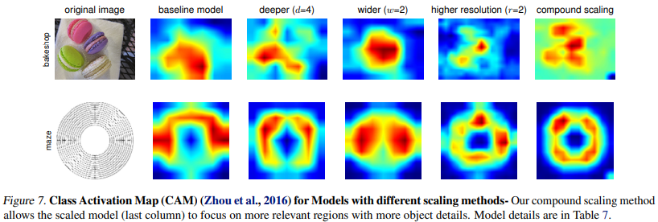

## 2019_EfficientNet [EfficientNet: Rethinking Model Scaling for Convolutional Neural Networks]

---

### ABSTRACT    
* CNN의 성능(정확도, 효율성)을 높이기 위한 방법: Scaling up!  
* 새로운 scaling 방법: compound coefficient(depth, width, resolution) 균형 맞추기!  
---
### 1. Introduction
* 복합 계수를 임의로 수동 조정 시, 차선의 성능을 얻을 수 있음  
* 경험적 연구에서 모든 차원(depth, width, resolution)에서 균형을 얻는게 중요함(일정한 비율)  
  * *compound scaling method*    

  

---
### 2. Related Work  
### 3. Compound Model Scaling  
#### 3.1 Problem Formulation  

*   

  * : output tensor  
  * : operator  
  * : input tensor, shape: "/>    
    * : spatial dim      
    * : channel dim    
 

* .PNG)  
  * : ConvNet  
  * : Length  
  * : Width  
  * : Resolution  
  * spatial dim은 축소되나 channel dim은 확장되는 형태  

 

* optimization problem:  
  * .PNG)  

#### 3.2 Scaling Dimensions
* optimal d, w, r  

##### Depth(d)  
* (+) 더 복잡한 피처 감지 가능, 새로운 문제의 일반화  
* (-) 사라지는 경사 문제   

##### Width(w)  
* (+) 세밀한 피처 감지 가능, 학습 용이성 증가   
* (-) 고차원 피처 감지가 어려워짐, 정확도가 더 빨리 포화됨   

##### Resolution(r)  
* (+) 세밀한 패턴 감지, 더 나은 정확도   
* (-) 높은 해상도를 가져야 함   

  

##### Observation 1  
* d, w, r 중 어떤 차원을 scaling up해도 정확도가 향상되지만, 모델이 클수록 이득이 감소함  

#### 3.3 Compound Scaling

  

##### Observation 1  
* ConvNet scaling에서 더 나은 성능(정확도, 효율성)을 추구하기 위해 하나의 차원을 scaling 하는것보다 모든 차원(d, w, r)의 균형을 맞추는것이 중요함  

**Compound scaling method**  
* .PNG)  

---

### 4. EfficientNet Architecture  
* mobile-size baseline  
*   
*   

---

### 5. Experiments  

  

 

  

#### 5.3 Transfer Learning Results for EfficientNet
  

  

  

---

### 6. Discussion  
  

* CAM(Class Activation Map)  
  * 모두 같은 베이스라인 기반으로 한 다른 scaling 방법  
  *   
    * compound scaling 방법이 오브젝트 디테일을 더 잘 표현  

  *   

---
